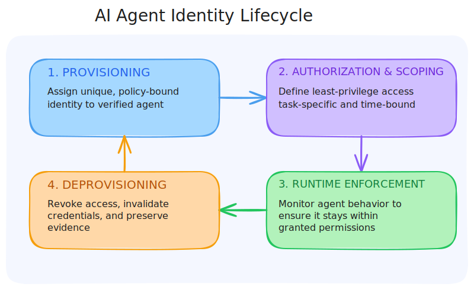
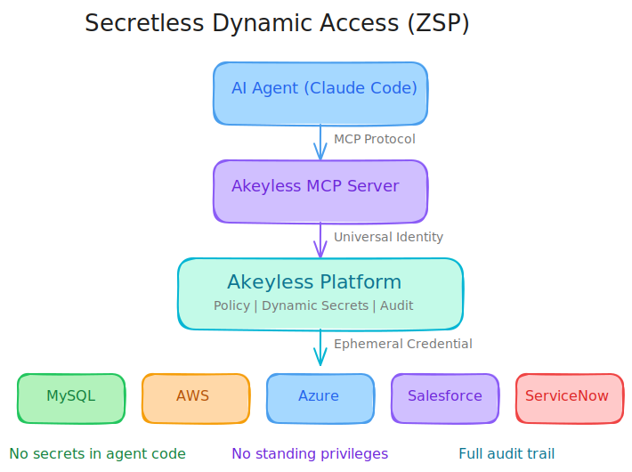

# Securing AI Agents

## How Identity-Based Access and Dynamic Credentials Enable Secure AI Automation

**Presented by Akeyless**

---

## The Year AI Agents Began to Act

- **Gartner** predicts 2026 = "a new wave of turbulence in the form of AI agent sprawl"
  *(Gartner, Dec 2025)*

- **80%** of organizations using AI agents admitted their agents took unintended actions, including unauthorized system access and data sharing
  *(SailPoint/Dimensional Research, May 2025)*

- **1 in 5** organizations experienced at least one AI agent-related security incident
  *(Neural Trust, Nov 2025)*

**"The question stops being whether an agent produces the right answer and becomes whether it should have been allowed to act at all."**

---

## Where Agent Deployments Go Wrong

- Teams **reuse existing credentials** because they are already approved
- They **widen permissions** to avoid blocking workflows
- Secrets pass through agent execution paths and connected tools **without clear ownership**
- Access **persists** because cleanup is deferred
- Non-human identities outnumber human identities by **144:1**
  *(Entro Labs, H1 2025)*

**"Each choice seems contained, but together they form a pattern that becomes hard to explain and harder to defend."**

---

## The Salesloft-Drift Breach (2025)

A real-world example of what standing access enables:

1. **Token compromise** -- OAuth access and refresh tokens from the Drift-Salesloft integration were stolen
2. **Valid authentication** -- Requests made with stolen tokens authenticated successfully to Salesforce
3. **Cross-system access** -- Tokens enabled access to Salesforce data across customer environments
4. **Late detection** -- Abuse was detected only after unusual access patterns emerged, not at the moment of misuse
5. **Manual containment** -- Response required revoking tokens, rotating credentials, and auditing access after the fact

**"Long-lived tokens in automated integrations function as standing access. Once exposed, they can be replayed across systems with little friction."**

---

## AI Agents Are an Identity Problem

**"When software can decide and act inside live environments, the consequences of its decisions matter as much as the quality of its outputs."**

- Traditional IdPs (Okta, Entra ID) were built for **humans**, not autonomous systems
- AI agents do not fit the old mold:
  - Behavior shaped by context
  - Tools selected dynamically
  - Movement across environments
- **"Actors require identity, and identity brings access control and accountability into scope."**
- The convergence of **human, machine, and agent identity** requires a unified approach

---

## The AI Agent Identity Lifecycle

**"AI agent identity must be task- and time-bound. Treating identity as a lifecycle prevents standing access from persisting after work ends."**

---

## The 4-Stage Maturity Model

| Stage | Approach | Description |
|-------|----------|-------------|
| **1. Static Secrets** | Hardcoded credentials | Secrets in source code, config files, basic vault stores. **Where most organizations are today.** |
| **2. Auto-Rotation** | Periodic rotation | Automate periodic rotation of credentials and API keys |
| **3. Dynamic Identities** | Zero Standing Privileges | Auto-creation and deletion of temporary identities only when required |
| **4. Secretless** | SSO for Machines | OAuth, OIDC, SPIFFE, and ZSP -- advanced authentication enabling identity-based access with no secrets to steal |

**"AI agents are the forcing function that pushes organizations from Stage 1 to Stage 4."**

---

## Akeyless: Identity Security for AI Agents

| Capability | What It Does |
|------------|-------------|
| **SecretlessAI** | JIT identity-based authentication -- no embedded secrets |
| **AI Agent Identity Provider** | Verifiable, federated identities for agents |
| **Universal Identity** | Solves the secret zero problem with child token hierarchies and auto-rotation |
| **Dynamic Secrets** | Ephemeral credentials with TTL for databases, cloud providers, and SaaS |
| **AI Insights** | AI-powered anomaly detection, audit trails, and automated remediation |
| **MCP Integration** | Native `akeyless mcp` command for AI tools -- Claude Code, Cursor, VS Code, Copilot |

---

## Architecture: Secretless Dynamic Access

**No secrets in agent code. No standing privileges. Full audit trail.**

1. The agent **proves identity** via Universal Identity
2. Akeyless **evaluates policy** against the request
3. A **short-lived credential** is issued for the target system
4. The credential **auto-expires** after the TTL

---

## Transition to Demo

| Before (Stage 1) | After (Stage 4) |
|---|---|
| Hardcoded password in Python script | Akeyless MCP + Universal Identity |
| Permanent database access | Dynamic credential with 5-min TTL |
| Credentials in git history | No secrets to leak |
| No audit trail | Full audit of every access |
| Manual revocation | Auto-expires, zero cleanup |

**"We are going from Stage 1 -- static secrets in code -- straight to Stage 4 -- secretless, identity-based access."**

**Watch the split screen.**

---

## Get Started with Secretless AI

### Resources

- **Akeyless MCP Server docs**
  [docs.akeyless.io/docs/mcp-server](https://docs.akeyless.io/docs/mcp-server)

- **AI Agent Identity Security Deployment Guide**
  PDF download available at the session link

- **Request a demo**
  [akeyless.io/demo](https://akeyless.io/demo)

- **Documentation**
  - Universal Identity: [docs.akeyless.io/docs/universal-identity](https://docs.akeyless.io/docs/universal-identity)
  - Dynamic Secrets: [docs.akeyless.io/docs/dynamic-secrets](https://docs.akeyless.io/docs/dynamic-secrets)
